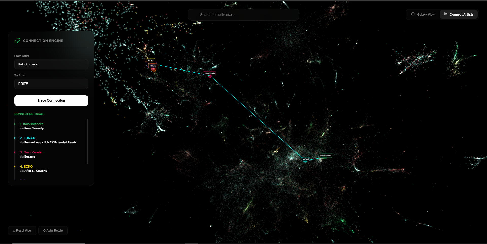
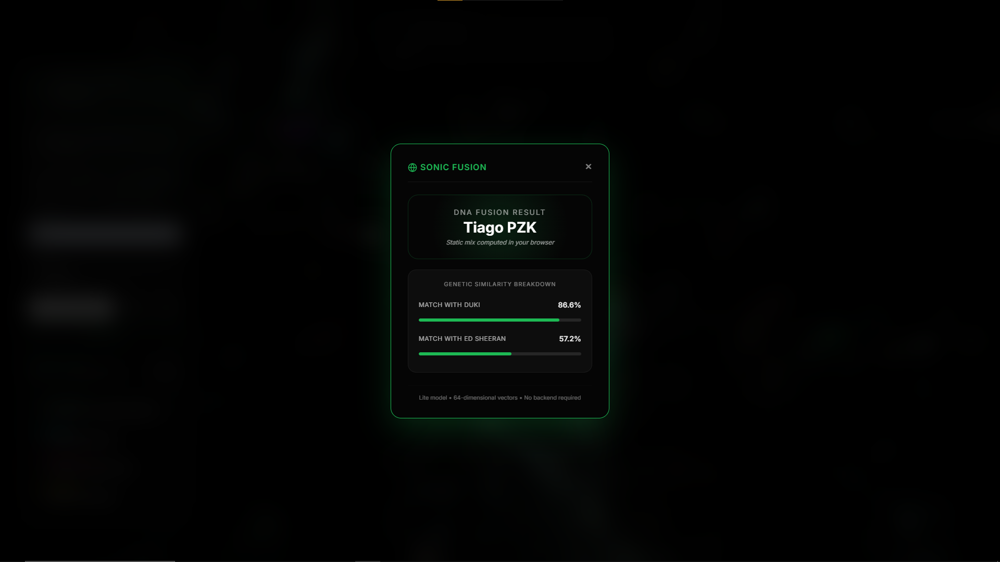

# Music Graph Explorer

Graph-based music intelligence demo for exploring artist relationships, tracing collaboration paths, and computing browser-side MixDNA lite from graph embeddings.

Live demo: `https://nathanmarinas2.github.io/music-graph-explorer/`

This repository is the public, portfolio-friendly version of a larger music analytics workspace. It turns a heavy graph and embedding pipeline into a static experience that people can actually open, use, and understand in seconds.



## Overview

Music Graph Explorer models the artist ecosystem as a graph.

- Each node is an artist.
- Each edge is a collaboration.
- Graph embeddings encode structural similarity between artists.
- UMAP projects those embeddings into 3D space for interactive exploration.
- A lightweight public edition exposes the most compelling part of the system without requiring a backend.

The public product is centered on `Connect Artists`: a static, browser-friendly experience for discovering routes between artists and computing MixDNA lite locally in the client.

## Why this project matters

The value of the project is not only the model or the visualization. The hard part is taking a large ML and data pipeline and turning it into something public, fast, and deployable.

This repo is meant to show that full chain:

- graph construction from raw collaboration data,
- embedding generation,
- dimensionality reduction for interactive visualization,
- public asset compression and optimization,
- and final product delivery as a static site.

That is why this project works well both as a product demo and as an engineering portfolio piece.

## Product highlights

- `Connect Artists`: trace collaboration paths between artists directly in the graph.
- `Track-aware hops`: many route steps include the track that connects two artists.
- `MixDNA lite`: blend artist representations directly in the browser with no backend round-trip.
- `Static deployment`: the public version runs as a static website and is easy to publish.



## Technical highlights

- Large-scale collaboration graph built with DuckDB.
- Node2Vec-style embeddings trained from random walks over the artist graph.
- UMAP-based 3D projection for exploration.
- Top-100k public subset to keep the experience usable in the browser.
- Quantized int8 embedding export for browser-side MixDNA.
- Static-site build pipeline for GitHub Pages or Cloudflare Pages.

## How it works

### 1. Build the collaboration graph

The graph is constructed from track and artist relationships using DuckDB.

- [pipeline/build_graph.py](pipeline/build_graph.py) filters valid artists by popularity.
- It joins track-level artist appearances.
- It generates unique artist-to-artist collaboration pairs.

### 2. Train graph embeddings

The collaboration graph is embedded using a Node2Vec-style strategy based on random walks and Word2Vec.

- [pipeline/train_embeddings_light.py](pipeline/train_embeddings_light.py) builds random walks over the graph.
- It trains 64-dimensional vectors that encode structural relationships between artists.

### 3. Project the graph into 3D

The latent vectors are reduced to 3D with UMAP.

- [pipeline/visual_data_prep.py](pipeline/visual_data_prep.py) loads embeddings.
- It applies UMAP from 64D to 3D.
- It enriches the resulting points with name, popularity, and genre metadata.

### 4. Build the public subset

The public edition does not ship the full graph.

- [pipeline/generate_top100k.py](pipeline/generate_top100k.py) keeps the most relevant top-100k artist subset.
- [pipeline/generate_edges_with_tracks.py](pipeline/generate_edges_with_tracks.py) preserves route explainability by attaching representative tracks to edges.

### 5. Export MixDNA lite

The public site uses a browser-friendly compressed embedding bundle.

- [pipeline/export_mixdna_lite.py](pipeline/export_mixdna_lite.py) chooses the best available model for public coverage.
- It quantizes float32 embeddings into int8 vectors with per-dimension scaling.
- It exports the compact files used by the browser demo.

### 6. Generate the static site

- [scripts/build_connect_artists_site.py](scripts/build_connect_artists_site.py) turns the source interface into a direct-entry public build.
- It copies the lightweight asset bundle into [docs](docs).
- The result can be published directly as a static website.

## Repository structure

- [web](web): editable source HTML for the public interface.
- [docs](docs): ready-to-publish static site bundle.
- [pipeline](pipeline): data preparation and public asset generation scripts.
- [scripts](scripts): deployment-oriented build logic.
- [core](core): shared configuration and helpers.
- [assets/screenshots](assets/screenshots): screenshots for GitHub and social sharing.
- [data](data): local-only generated artifacts that are intentionally ignored by git.

## Running the demo locally

The easiest way to try the project is to serve the static site already included in [docs](docs).

```bash
python -m http.server 8000 -d docs
```

Then open `http://127.0.0.1:8000`.

You can also use VS Code Live Server or any static file server.

## Rebuilding the public site

If you update the UI or regenerate the lightweight public assets, run:

```bash
python scripts/build_connect_artists_site.py
```

The script expects the generated asset bundle to exist either in [data](data) or in the directory pointed to by `SPOTIFY_DATA_DIR`.

## What is included in this public repo

Included:

- source code,
- public static site in [docs](docs),
- lightweight demo assets,
- screenshots and documentation.

Excluded:

- raw parquet datasets,
- temporary DuckDB spill data,
- private workspace artifacts,
- heavy model files that are not required for the public demo.

## Stack

- Python
- DuckDB
- Pandas
- NumPy
- Gensim / Word2Vec
- UMAP
- HTML / CSS / JavaScript
- Three.js

## Limitations

- This repository contains the public subset, not the full private workspace.
- The browser demo is optimized for the top-100k artist slice rather than the full graph.
- Some larger experimental assets are intentionally excluded to keep the public repo usable.

## Portfolio context

This project is meant to demonstrate end-to-end AI and product engineering:

- turning structured music metadata into a graph,
- training usable latent representations,
- converting embeddings into an interactive visual experience,
- compressing ML artifacts for client-side execution,
- and shipping the result as a public-facing product.

## Disclaimer

This is an independent technical project and is not an official Spotify product.
